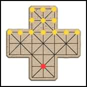
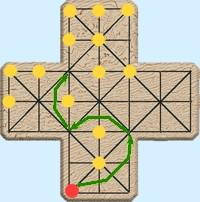
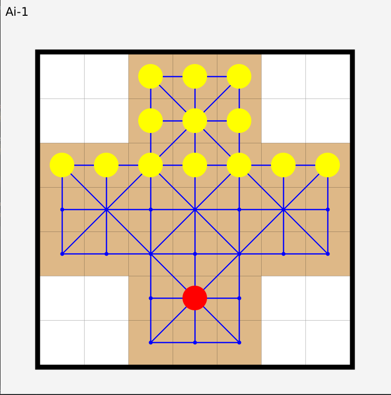
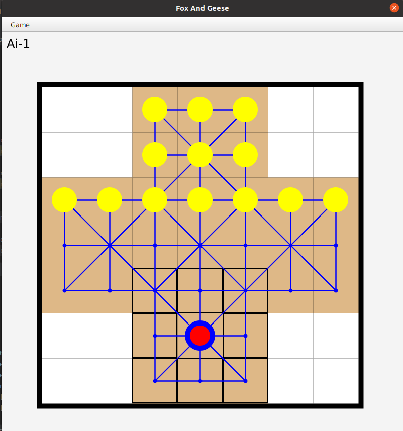
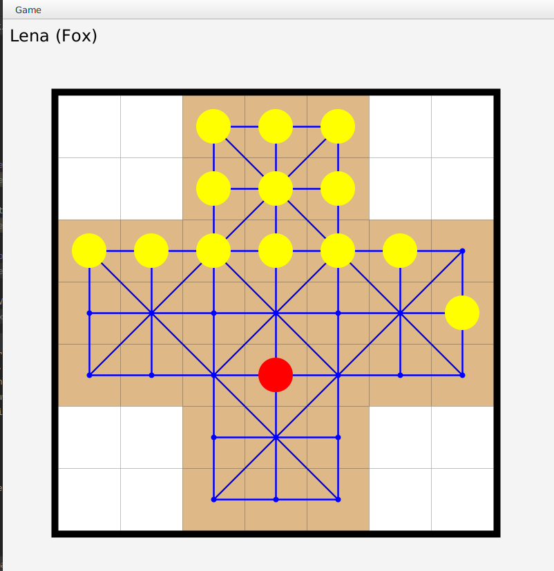
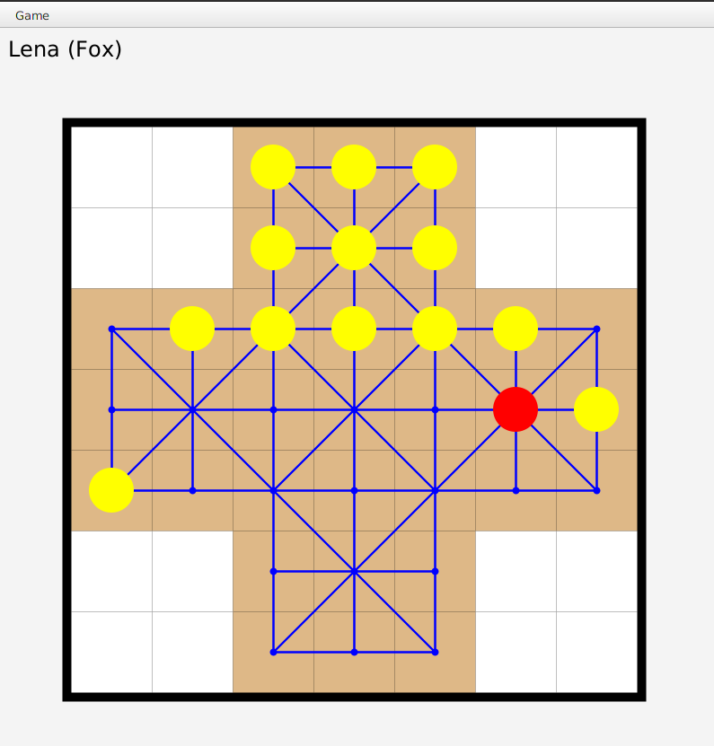
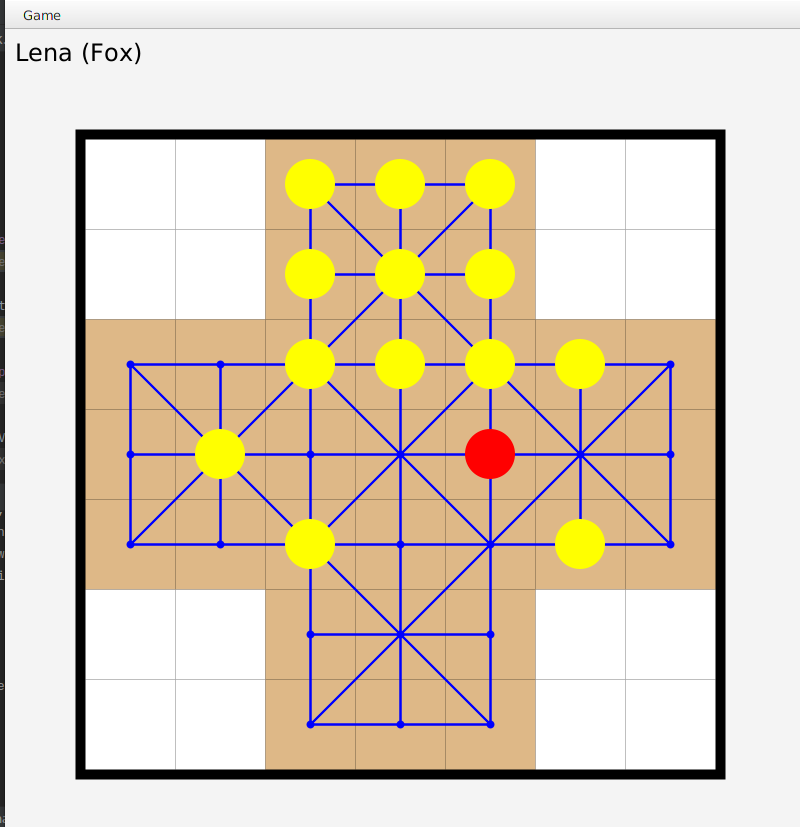
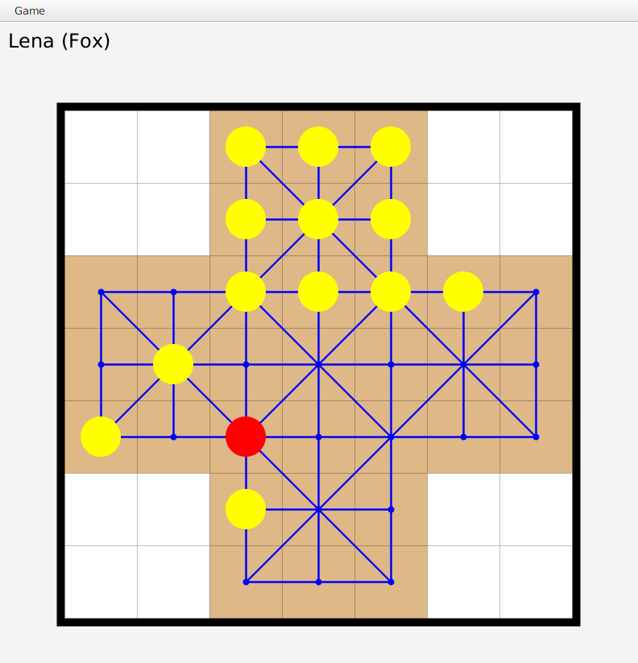
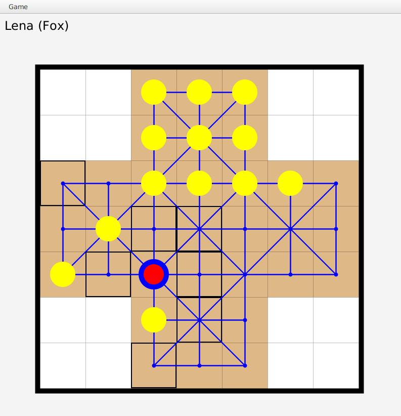
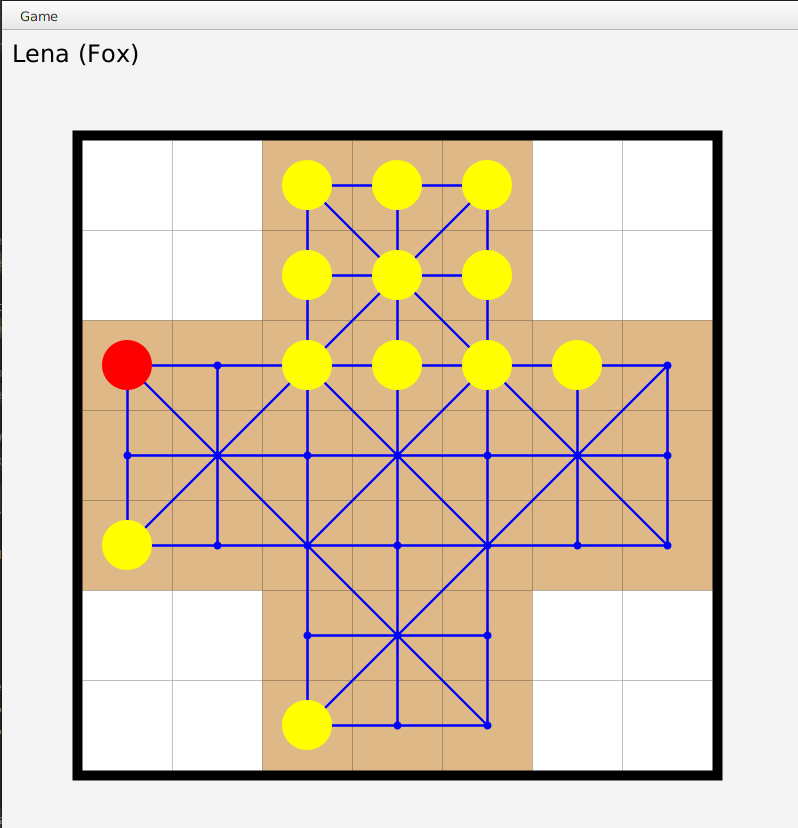

# SAE1.26: Human Machine Interface
## Fox and Geese boardgame

### COMPOSITION

The game consist of one boardgame, 13 yellow pawn geese and 1 red pawn fox.

<center>


</center>

### RULES

The fox (red) plays first, then everyone plays in turn.

The fox can move in 8 directions following the lines:
<center>


</center>


Geese cannot move backwards or move diagonally, they can only move in 3 directions.
<center>


</center>

The fox can capture a hen and eliminate it from the board by jumping over it in a straight line, it can chain jumps.
<center>


</center>

### END OF THE GAME
 The fox wins if he manages to eliminate 7 geese. The geese win if they manage to block the fox.
 
-----------------------------------------------------------------------------------------------------
## LOOK OF THE GAME
When first running the game, the game will appear like this. [***Here the human is the Fox and the AI, the goose.***]



After a few moves from the Fox...



We ate a Goose!




------------------------------------------------------------------------------------------------------
## User interface – How to play the game

 &emsp;At the end of the project the view and the control of the game will be 100% graphical
oriented. Before these features are ready, we use command line arguments to configure the
game options such as the modes, the name of the players, the team membership and
selection of the AI algorithms. For example, among the modes of operations one can select
one of the 4 following modes:
- Human against Human
- Human against Computer
- Computer against Computer (1 game)
- Profiler mode (computer against computer, multiple games)
  
 &emsp;As a result, the program can be run with the following parameters, as reported by the
command ***‘java Fag -h’***:
```
Usage: FoxAndGeese [OPTIONS]
List of options:
 -m|--mode   <Single|DoubleHuman|DoubleComputer> The gaming mode (HUMAN-COMPUTER, HUMAN-HUMAN, COMPUTER-COMPUTER).
 -n1|--name1 <NameOfPlayer1> The name of player #1.
 -n2|--name2 <NameOfPlayer2> The name of player #2.
 -t1|--team1 <Fox|Geese>     The team of player #1.
 -t2|--team2 <Fox|Geese>     The team of player #2.
 -a1|--algo1 <0|1|2>         The algorithm strength of computer #1.
 -a2|--algo2 <0|1|2>         The algorithm strength of computer #2.
 -s|--seed  <LONG> The seed of the random generator. If 0, (TODO-TBD).
Enjoy the game...
```

**Example :** 
``` 
--mode DoubleComputer --algo1 1 --algo2 1 --seed 42
```

**VM options:**
``` 
--module-path /usr/share/openjfx/lib --add-modules=javafx.base,javafx.controls,javafx.fxml,javafx.graphics,javafx.media,javafx.swing,javafx.web
``` 

**Add JavaFX, JUnit tutorial...**

https://cours-info.iut-bm.univ-fcomte.fr/index.php/menu-cours-s2/mmi1bobj-menu-2/2265-tutoriel-1-creer-un-projet-idea-utilisant-le-framework-gamifier        
https://cours-info.iut-bm.univ-fcomte.fr/index.php/menu-cours-s2/mmi1bobj-menu-2/2283-tutoriel-2-ajouter-junit-a-un-projet-idea-gamifier

